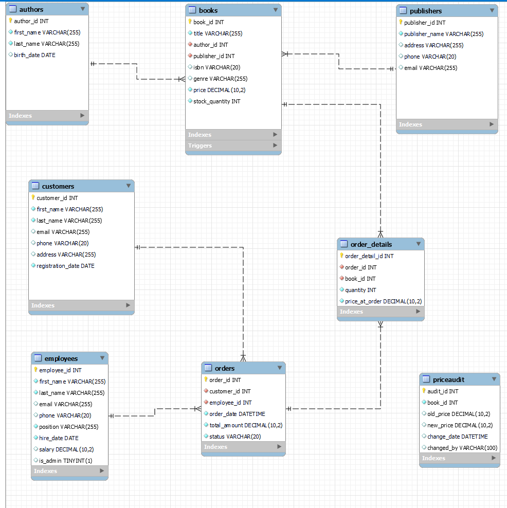

# База данных для системы управления книжным магазином


## Описание

---

## Типовые запросы

**Поиск книг по автору:**

```sql
SELECT b.title, b.price, p.publisher_name 
FROM Books b
JOIN Authors a ON b.author_id = a.author_id
JOIN Publishers p ON b.publisher_id = p.publisher_id
WHERE a.last_name = 'Толстой';
```

**Популярные книги (например,топ-5 по продажам):**

```sql
SELECT b.title, a.first_name, a.last_name, SUM(od.quantity) as total_sold
FROM Order_Details od
JOIN Books b ON od.book_id = b.book_id
JOIN Authors a ON b.author_id = a.author_id
GROUP BY b.book_id
ORDER BY total_sold DESC
LIMIT 5;
```

**Заказы клиента за определенный период:**

```sql
SELECT o.order_id, o.order_date, o.total_amount, o.status
FROM Orders o
WHERE o.customer_id = 123 
AND o.order_date BETWEEN '2025-01-01' AND '2025-12-31'
ORDER BY o.order_date DESC;
```

**Продажи по сотрудникам:**

```sql
SELECT e.employee_id, e.first_name, e.last_name, 
       COUNT(o.order_id) as orders_count, 
       SUM(o.total_amount) as total_sales
FROM Employees e
JOIN Orders o ON e.employee_id = o.employee_id
WHERE o.order_date BETWEEN '2023-01-01' AND '2023-12-31'
GROUP BY e.employee_id
ORDER BY total_sales DESC;
```

**Книги, которых осталось мало на складе:**

```sql
SELECT b.title, b.stock_quantity, p.publisher_name
FROM Books b
JOIN Publishers p ON b.publisher_id = p.publisher_id
WHERE b.stock_quantity < 5
ORDER BY b.stock_quantity ASC;
```

---

## Хранимая процедура
**Данная хранимая процедура показывает оформление заказов в книжном магазине**
``` sql
CALL ProcessOrder(
    3,                  -- customer_id (ID клиента)
    2,                  -- employee_id (ID сотрудника)
    '1,5,10',           -- book_ids (ID книг через запятую)
    '2,1,3'             -- quantities (количество каждой книги)
);
```
---

## Представления
**Анализ продаж (топ-5 самых продаваемых книг):**
```sql
SELECT * FROM SalesReport ORDER BY total_sold DESC LIMIT 5;
```
**Расчет прибыли по издательствам (суммарная выручка по издательствам):**
```sql
SELECT publisher_name, SUM(total_revenue) AS publisher_revenue
FROM SalesReport
GROUP BY publisher_name;
```
---

## Триггеры
**Посмотреть текущую цену**
```sql
SELECT book_id, title, price FROM Books WHERE book_id = 1;
```
**Изменить цену**
```sql
UPDATE Books SET price = 900 WHERE book_id = 1;
```
**Проверить аудит**
```sql
SELECT * FROM PriceAudit WHERE book_id = 1;
```
